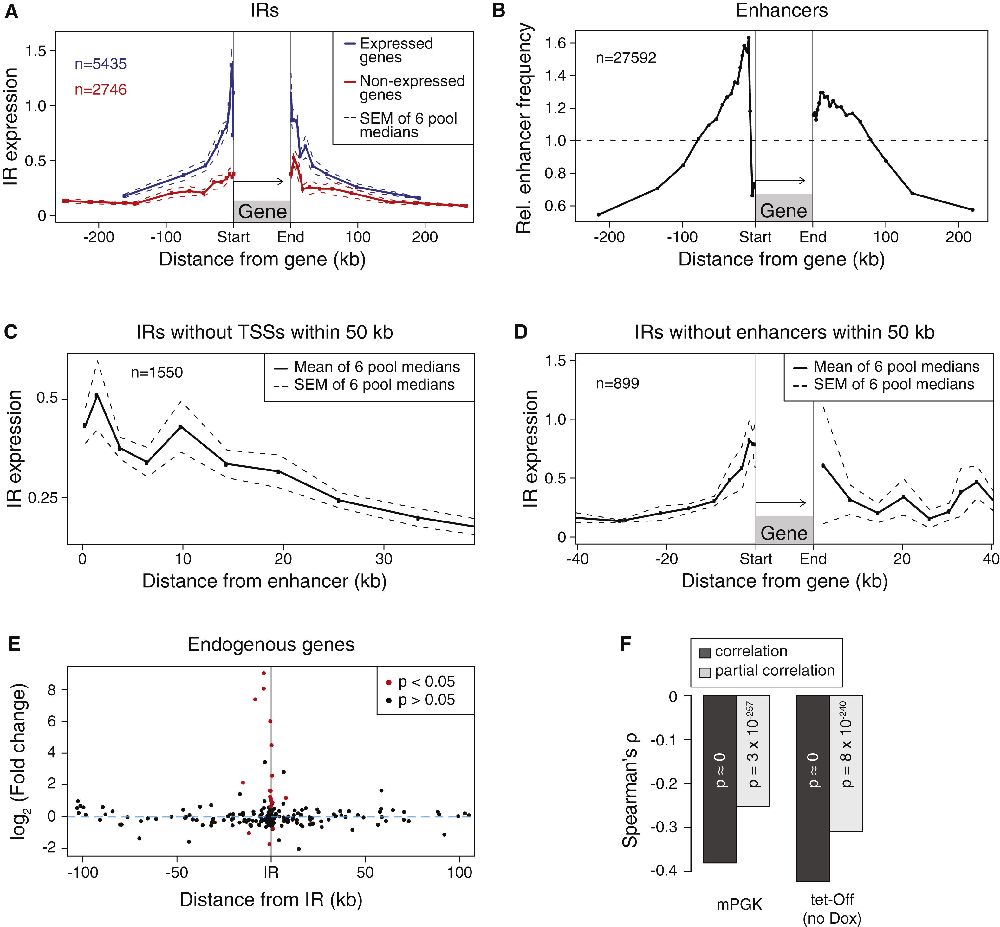
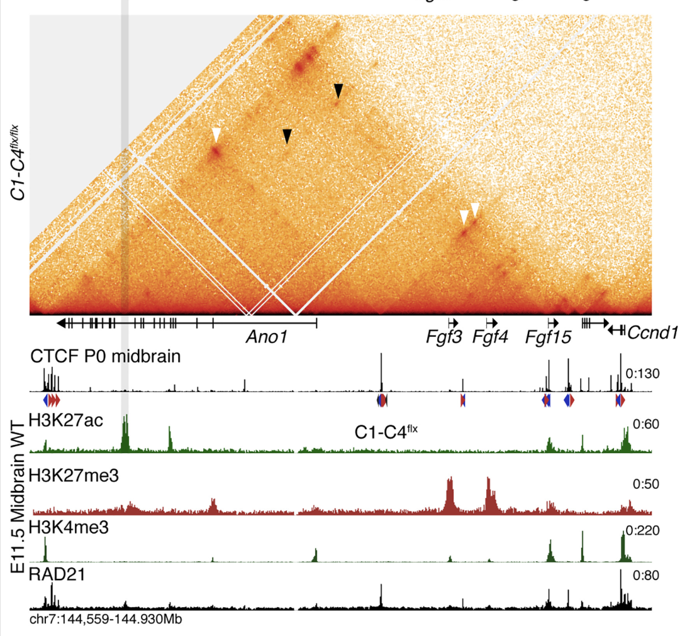

# Genomic Neighborhood Effects on Reporter Gene Expression

## Description
Our project explores the role that genomic contexts have on gene expression by reproducing a figure from [Akhtar et al. 2013](https://www.cell.com/fulltext/S0092-8674(13)00889-1). The genomic context is an important factor of transcriptional regulation because nearby regulatory elements, chromatin accessibility, and local chromatin state can influence how strongly a gene is expressed. Disruption of the noncoding regions surrounding a gene can often lead to dysregulation of gene expression, but it can be challenging to study genomic context on a genome wide scale. To better understand chromatin position effects, Akhtar et al created a barcoded transgene reporter assay, Thousands of Reporters Integrated in Parallel (TRIP) to study the impact chromatin context has on transcription across the genome. In our project, we are re-analyzing Figure 6 to compare reporter expression to its proximity to enhancers and nearby genes. Our stretch goal is to visualize several IRs using publicly available datasets such as incorporating a recently published [MicroC dataset (Jusuf et al 2026, Nat Struct Mol Biol)](https://pmc.ncbi.nlm.nih.gov/articles/PMC13523127/#SM1) to compare the genome wide observations to locus specific examples. Overall, this project will help us gain a deeper understanding of the role chromatin context has on transcriptional regulation. 

## Example published figure
The primary analysis of this project is based on Figure 6 from Akhtar et al. (2013), which demonstrates the relationships between TRIP reporter expression and the proximity of endogenous genes and enhancers.

**Figure 6 from [Akhtar et al. (2013)](https://www.cell.com/fulltext/S0092-8674(13)00889-1), showing the effects of gene and enhancer proximity on reporter expression.*

For our Micro-C stretch goal, the following figure provides an example of locus-specific visualization integrating chromatin context and gene regulation.

  

**Figure 5 from [Chakraborty et al. (2025)](https://www.sciencedirect.com/science/article/pii/S1534580725000644), illustrating a locus-specific example of chromatin context and gene regulation.*

## Datasets
### 1. TRIP and RNA-seq data

- Primary data source: [GEO SuperSeries GSE48606](https://www.ncbi.nlm.nih.gov/geo/query/acc.cgi?acc=GSE48606) (Akhtar et al., 2013) containing the TRIP and RNA-seq datasets associated with the study.
- mPGK TRIP pools for Figure 6A, 6C, 6D (Data S1): [GEO GSE48608](https://www.ncbi.nlm.nih.gov/geo/query/acc.cgi?acc=GSE48608)
- Monoclonal mPGK integration mapping for Figure 6E (Data S3): [GEO GSE49807](https://www.ncbi.nlm.nih.gov/geo/query/acc.cgi?acc=GSE49807)
- RNA-seq of the 11 monoclonal mESC lines for Figure 6E (Data S4): [GEO GSE48607](https://www.ncbi.nlm.nih.gov/geo/query/acc.cgi?acc=GSE48607)

### 2. Genome reference and gene annotation: UCSC mm9 / NCBI build 37 
- [Mouse reference genome:](https://hgdownload.soe.ucsc.edu/goldenPath/mm9/bigZips/mm9.fa.gz) Common coordinate system for TRIP integrations, genes, and enhancer annotations
- [Mouse gene annotation: ](https://hgdownload.soe.ucsc.edu/goldenPath/mm9/bigZips/genes/mm9.ensGene.gtf.gz) Gene boundaries, TSS/TES, intergenic classification, nearest-gene distances

### 3. mESC enhancer-associated ChIP-seq data
Akhtar et al. (2013) constructed active enhancer annotations from previously published mESC ChIP-seq data, including H3K4me1, H3K27ac, p300, and H3K4me3 from[Creyghton et al. (2010), GEO GSE24164](https://www.ncbi.nlm.nih.gov/geo/query/acc.cgi?acc=GSE24164). Their workflow required reprocessing raw ChIP-seq data, including alignment to mm9, duplicate removal, peak calling, and peak filtering. Instead of reconstructing this older enhancer annotation from raw data, we will use a more recentand standardized ENCODE cCRE annotation from 129 ES-E14 mouse embryonic stem cells [ENCSR433TOM](https://www.encodeproject.org/annotations/ENCSR433TOM/). This cell line closely matches the E14/129 background used in the original TRIP study and provides a curated regulatory-element annotation based on integrated DNase-seq, H3K27ac, H3K4me3, and rDHS signals. Because the ENCODE annotation is based on the mm10 mouse genome assembly whereas the original TRIP integration coordinates are in mm9, we will use [UCSC LiftOver](https://genome.ucsc.edu/cgi-bin/hgLiftOver) to place the datasets in a common coordinate system before the proximity analyses.

### 4. Endogenous mESC gene expression
RNA-seq data from the 11 monoclonal mESC lines generated by Akhtar et al. (2013), [GEO GSE48607](https://www.ncbi.nlm.nih.gov/geo/query/acc.cgi?acc=GSE49807). The available processed dataset provides Ensembl gene-level raw read counts across 11 mESC lines. The original Figure 6A classified genes as expressed (FPKM > 0) or not detectably expressed (FPKM = 0). Because the original FPKM table is not separately provided, we will use the available RNA-seq counts as a proxy for this binary expression classification, and assess whether the resulting gene counts are consistent with the published figure.

### 5. Micro-C
[GEO GSE286495](https://www.ncbi.nlm.nih.gov/geo/query/acc.cgi?acc=GSE286495) provides high-depth Micro-C maps from mESCs, which will be used for locus-specific visualization of 3D chromatin contacts.

## Software

- **Python (v3.12.14)** – data processing and organization of genomic datasets.  
  [https://www.python.org/](https://www.python.org/)

- **BEDTools (v2.31.1)** – genomic interval operations, including overlaps and nearest-gene/enhancer distance calculations.  
  [https://bedtools.readthedocs.io/](https://bedtools.readthedocs.io/)

- **R (v4.5.3)** with **tidyverse (v2.0.0)** – used for data cleaning, transformation, summarization, and visualization of TRIP and RNA-seq results.  
  [https://www.r-project.org/](https://www.r-project.org/) | [https://www.tidyverse.org/](https://www.tidyverse.org/)

- **DESeq2 (v1.50.2)** – differential-expression analysis of the 11 monoclonal mESC RNA-seq samples.  
  [https://bioconductor.org/packages/DESeq2/](https://bioconductor.org/packages/DESeq2/)

- **UCSC LiftOver** – conversion of genomic coordinates between mouse genome assemblies using the appropriate UCSC chain file.  
  [https://genome.ucsc.edu/cgi-bin/hgLiftOver](https://genome.ucsc.edu/cgi-bin/hgLiftOver)

- **resgen.io** (web platform) – locus-specific visualization of IRs, Micro-C data, and epigenomic tracks.  
  [http://resgen.io](http://resgen.io)

## Goals

### Goal 1: Reanalyze the gene- and enhancer-proximity relationships of TRIP reporter integrations using updated genomic annotations.
Process the six mPGK TRIP pools by calculating normalized reporter expression for each integration region (IR) as expression counts divided by normalization counts. Using gene annotations and a more recent ENCODE cCRE annotation from 129 ES-E14 mouse embryonic stem cells, annotate each IR with genomic position, genic/intergenic status, distance to the nearest gene boundary, and distance to the nearest enhancer-like regulatory element. Because the TRIP and ENCODE datasets use different mouse genome assemblies, UCSC LiftOver will be used to place them in a common coordinate system. We will then reanalyze the gene- and enhancer-proximity relationships following the general framework of Figure 6A–D in Akhtar et al. (2013).

### Goal 2: Reproduce Figure 6E using RNA-seq from the 11 monoclonal mESC lines.
Use the published gene-level raw read counts from the 11 monoclonal mESC lines and analyze differential expression using DESeq, following Akhtar et al. (2013). For each clone, the other ten clones will serve as the reference, and gene-expression changes will be calculated relative to the mean read count in the reference samples. Using the mapped IRs for each clone and the mm9 gene annotation, we will calculate the genomic distance between each intergenic IR and nearby genes and reproduce the relationship between IR proximity and endogenous gene-expression changes shown in Figure 6E.

### Goal 3 (stretch): Integrate published Micro-C data for locus-specific visualization.
As a stretch goal, we will visualize selected IRs at a locus-specific scale by incorporating published Micro-C data to examine 3D chromatin contacts in wild-type mESCs. We will use [resgen.io](http://resgen.io) to visualize processed IR coordinates together with H3K27ac and H3K4me3 bigWig tracks and a recent Micro-C dataset. The goal is to identify (1) representative loci that are consistent with the conclusions from the genome-wide analyses and (2) interesting loci that deviate from those trends for further inspection
